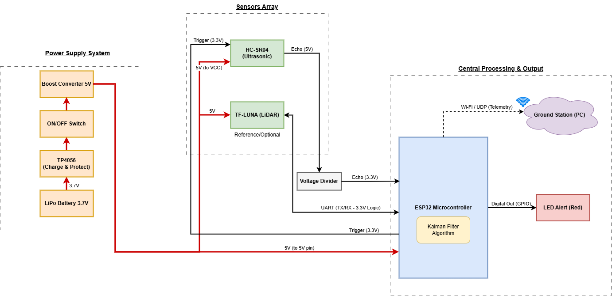
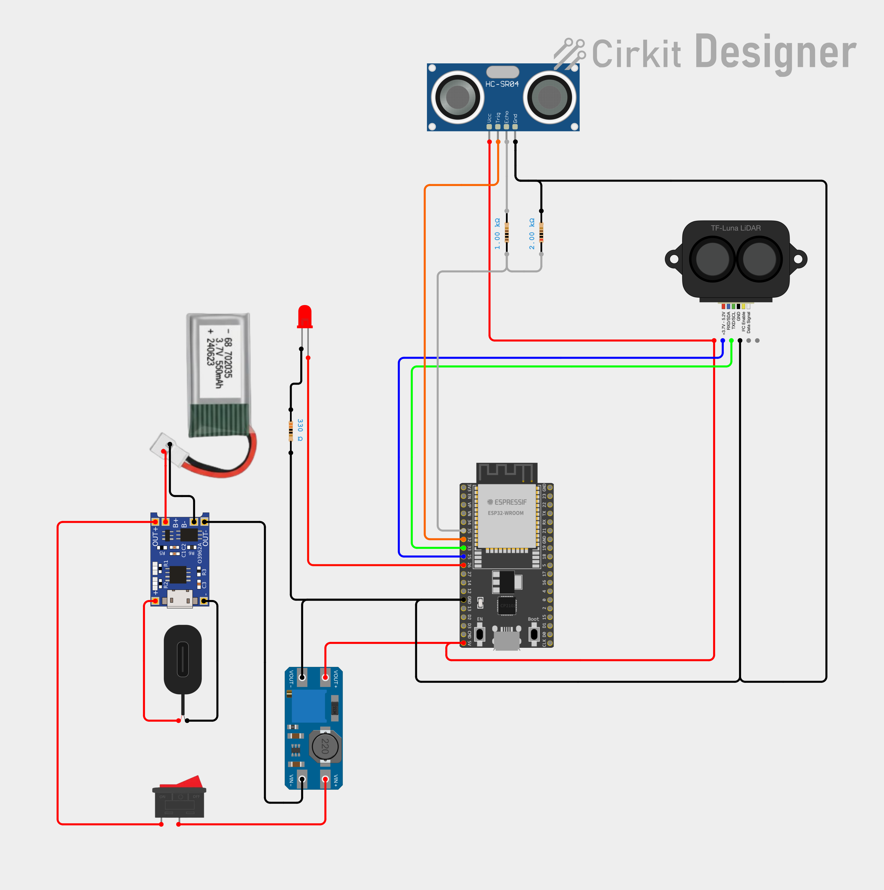
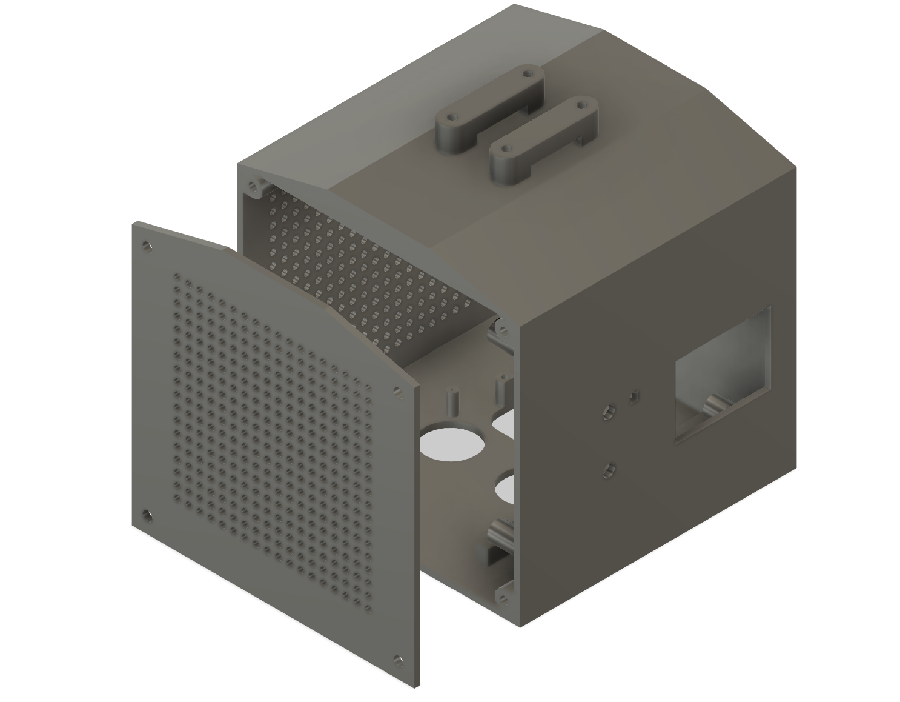
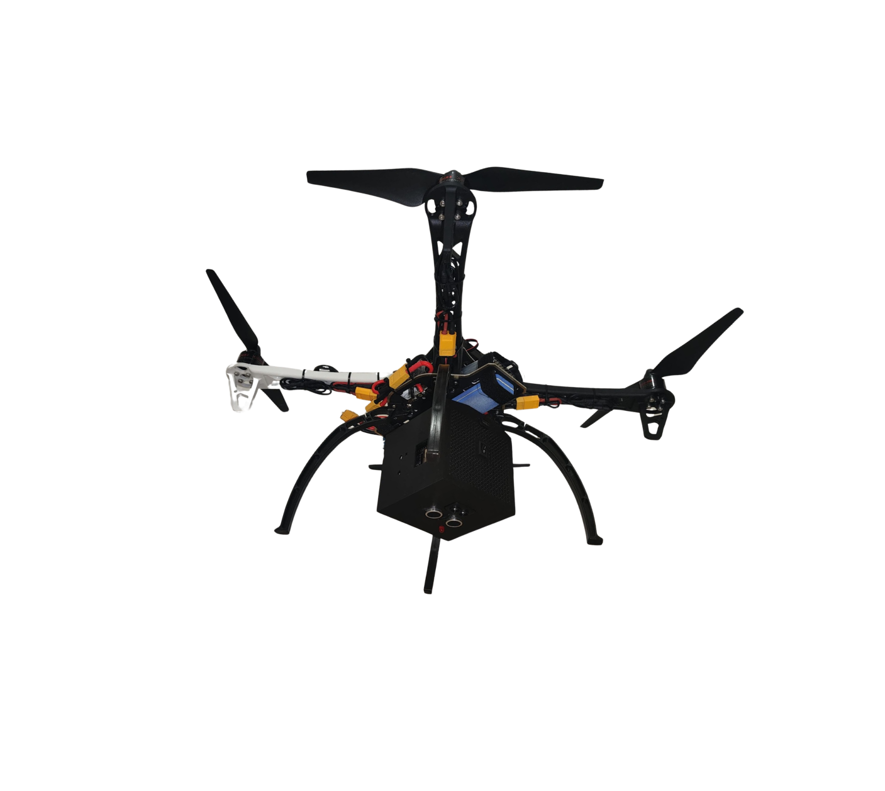

# Drone Altitude Estimation System 🛸
**An Independent Standalone Payload utilizing ESP32 and Linear Kalman Filtering**

Developed as a Final Graduation Project at **Ruppin Academic Center** (2026).
* **Authors:** Netzach Israel Zvolunov & Avishag Avraham
* **Advisor:** Mr. Uzi Chester

---

## 📌 Project Overview
This project presents a standalone, independent payload module designed for real-time quadcopter altitude tracking and safety alerts. To overcome the high-noise environment caused by mechanical vibrations and propeller downwash, the system implements a **Linear Kalman Filter (LKF)** modeled on Constant Velocity (CV) kinematics. 

The system reads dynamic time-of-flight measurements from an ultrasonic sensor (HC-SR04), compensates for mechanical ring-up time biases through linear interpolation calibration, and uses a VCSEL-based laser LiDAR (TF-Luna) as a temporary practical ground truth reference for performance evaluation.

## 🛠️ Key Features
* **Dual-Core Processing:** Implemented in C++ on an ESP32 MCU using FreeRTOS to decouple time-critical sensor sampling from Wi-Fi UDP telemetry transmission.
* **Robust Noise Rejection:** Real-time 30Hz Kalman filtering capable of ignoring sensor time-outs and extreme outliers.
* **Physics-Based Simulation & Telemetry:** Comprehensive MATLAB FDTD wave propagation modeling alongside a real-time UDP Ground Station tracking tool.
* **Hardware Alert System:** Local GPIO-driven physical red LED warning when dropping below a defined safety threshold (1.0m).

---

## 📐 System Architecture
Here is the systemic breakdown of information and electrical distribution paths:

---

## 🔌 Hardware Wiring Diagram
The following layout represents the practical hardware integration, showcasing the custom independent power grid (LiPo 3.7V to 5V Boost) and the mcu protection voltage divider:

---

## 📐 Enclosure & Drone Integration
Custom standalone enclosure designed in Fusion 360 to securely house the payload components underneath the F450 quadcopter chassis while maintaining its center of gravity:

| 3D Enclosure View | Integrated Drone Payload |
| --- | --- |
|  |  |

---

## 📁 Repository Directory Structure
* `/Firmware` : Contains the production C++ code (`esp32_ultrasonic_kalman_telemetry.ino`) for the ESP32 microcontroller, utilizing hardware interrupts and non-blocking timers.
* `/Simulation` : Complete MATLAB physics and mathematical modeling files:
  * `acoustic_wave_fdtd_simulation.m` — 1D FDTD acoustic propagation.
  * `kalman_filter_model_comparison_gui_exported.m` — Object-Oriented MATLAB App Designer dashboard comparing CV and CA models.
* `/GroundStation` : Live diagnostic and telemetry tools running on the ground PC:
  * `ground_station_telemetry_dashboard.m` — Real-time 30Hz UDP telemetry receiver and absolute error plotter.
* `/Hardware` : Contains the Cirkit Designer wiring layout, enclosure image, and production-ready 3D files designed in Fusion 360:
  * `Drone_Box_Body.3mf` — Main chassis.
  * `Drone_Box_Lid.3mf` — Secure interlocking cover.
  * `schematic_wiring_diagram.png` — Real-world wiring schematic.
    * `enclosure_view.png` — Image of the 3D enclosure box.
  * `drone_assembly_view.png` — Photo of the payload integrated onto the F450 drone.

---

## 📊 Quick Start & Telemetry Activation
1. **Hardware Setup:** Connect the HC-SR04 through a 1kΩ/2kΩ voltage divider to GPIO35 (Echo) and GPIO32 (Trigger). Wire the TF-Luna to UART2 (GPIO33/25).
2. **Firmware Deployment:** Flash the ESP32 core via Arduino IDE using the `esp32_ultrasonic_kalman_telemetry.ino` file. Ensure the calibrated measurement noise covariance R = 0.000396 and process noise variance \(\sigma_a^2 = 3.36\) are properly defined in the configuration.
3. **Ground Station Telemetry:** Open MATLAB, run `ground_station_telemetry_dashboard.m` from the `/GroundStation` folder, and connect to the ESP32's local Access Point port via UDP to monitor real-time tracking.
